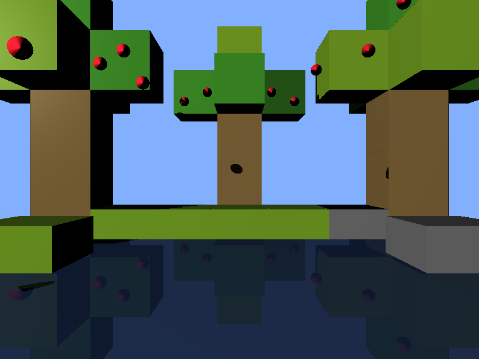

# Proyecto 2: Raytracer

## Objetivo
Que los estudiantes pongan en práctica todos los conocimientos adquiridos sobre raytracing

## Requerimientos
Deben escoger una escena, un paisaje o una foto de la naturaleza que les guste. Traten de replicar esta fotografía utilizando solo figuras geométricas simples y utilizando raytracing.

No pueden usar librerías externas a su lenguaje de programación. Su nota máxima es 100 puntos. Deben entregar la foto de su escena junto con su render y el software para renderizar.

## Puntos:

- [20 puntos] Criterio subjetivo. Por qué tan compleja sea su escena
- [20 puntos] Criterio subjetivo. por qué tan visualmente atractiva sea su escena

- [5 puntos] por cada material diferente que implementen, para un máximo de 5
- [5 puntos] extra por cada uno de estos materiales que tenga texturas
- [10 puntos] por implementar refracción en al menos uno de sus materiales
- [5 puntos] por implementar reflexión en al menos uno de sus materiales
- [30 puntos] por implementar figuras geométricas distintas a esferas, cubos, rectangulos y planos
- [20 puntos] por cargar un modelo obj

## Resultado:

La escena realizada fue la siguiente:

